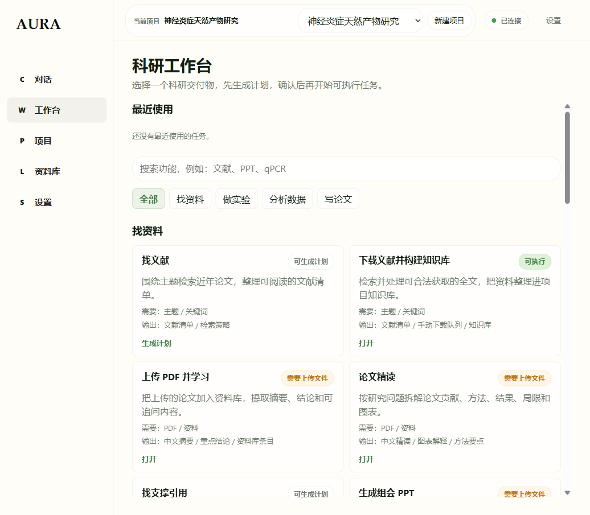

# AURA Research

**面向湿实验科研人员的本地研究工作台。**

AURA Research（ResearchOS）帮助你围绕一个研究项目完成文献整理、实验设计、数据分析规划与论文写作准备，把对话、资料和生成的研究交付物保存在同一处。


## 目录

- [产品简介](#产品简介)
- [能做什么](#能做什么)
- [如何使用](#如何使用)
- [科研工作台](#科研工作台)
- [项目与资料库](#项目与资料库)
- [开始使用](#开始使用)
- [功能状态说明](#功能状态说明)
- [许可证](#许可证)

## 产品简介

AURA Research 面向生物、医学、药学、材料、食品与其他湿实验研究场景。你可以为每个课题建立独立项目，在对话中描述研究问题，也可以从工作台选择明确的科研任务。

产品围绕四类日常工作组织能力：

- **找资料**：检索文献、处理可获取全文、整理知识库、精读论文和寻找引用支撑。
- **做实验**：设计实验方案、生成 SOP 计划、复盘实验失败并整理下一步工作。
- **分析数据**：规划表格与常见实验数据分析、解释组学结果、整理图表方案。
- **写论文**：准备段落、英文润色、模拟审稿、整理审稿回复和项目周报。

## 能做什么

| 研究场景 | 你可以发起的任务 | 典型输出 |
| --- | --- | --- |
| 文献与知识整理 | 找文献、下载文献并构建知识库、上传 PDF 并学习、论文精读 | 文献清单、中文摘要、知识条目、手动下载队列 |
| 实验规划与复盘 | 设计实验方案、生成 SOP、实验失败复盘、记录今天实验 | 分组设计、质控清单、排查计划、实验记录 |
| 数据与图表 | 表格分析、qPCR / ELISA / CCK-8 分析规划、代谢组解释、论文图表方案 | 统计方案、结果解释、图表建议 |
| 写作与汇报 | 论文段落、英文润色、模拟审稿、审稿回复、组会 PPT、项目周报 | 初稿、修改建议、回复草稿、汇报大纲 |

## 如何使用

1. **创建项目**：为课题建立独立空间，让对话、资料和后续结果保持在同一研究上下文中。
2. **描述任务**：直接输入研究问题，或选择“文献采集”“实验设计”“数据分析”“SOP 生成”等快捷入口。
3. **确认计划**：系统会在执行前整理所需信息、步骤和预期输出；需要补充文件或授权时会明确提示。
4. **查看结果**：文献清单、知识条目、生成文档和待人工处理的材料会归入当前项目的资料库。
5. **继续推进**：基于已有资料继续提问、修改交付物或发起下一项研究任务。

## 科研工作台

工作台将任务按“找资料、做实验、分析数据、写论文”归类。每项任务都会展示需要提供的材料、可获得的输出，以及当前可执行状态。



### 找资料

- 围绕主题整理可阅读的文献清单和检索策略。
- 处理可合法获取的全文，并将整理结果写入项目知识库。
- 基于 PDF 提取中文摘要、重点结论与图表解读。
- 为论点寻找引用支撑，或准备组会汇报大纲。

### 做实验

- 根据研究目标生成实验分组、指标、流程与质控点。
- 将论文方法或实验描述整理为 SOP 计划。
- 围绕失败现象梳理原因假设与排查路径。
- 把实验观察整理为记录、待办和下一步计划。

### 分析数据与写论文

- 根据表格或实验类型规划统计比较与图表输出。
- 整理代谢组结果解释与后续验证思路。
- 准备论文段落、英文润色建议、审稿意见和回复草稿。
- 汇总项目进展、风险和下周计划。

## 项目与资料库

- **项目**：每个课题拥有独立上下文，可创建、选择、归档或清理项目。
- **资料库**：统一查看已上传文件、文献清单、生成文档、手动下载队列和项目知识条目。
- **对话**：围绕当前项目持续追问，并保留对话记录用于后续研究推进。
- **设置**：管理本地运行偏好与模型连接；开发者诊断内容默认不出现在日常工作界面中。

## 开始使用

需要本机已安装 Node.js/npm 与 Python。进入项目目录后运行：

```powershell
npm install
npm run client:electron
```

应用将打开 AURA Research 桌面界面。首次使用时，创建项目后即可从对话页或科研工作台开始。

如需接入模型服务，可参考 `.env.example` 填写本地配置。

## 功能状态说明

AURA Research 会在工作台中标注每项能力的当前状态，避免把计划或待接入能力误认为已完成结果：

- **可执行**：当前可提交执行的流程，例如“下载文献并构建知识库”“设计实验方案”。
- **可生成计划**：可整理步骤、输出结构与后续动作的任务，例如 SOP、失败复盘和写作准备。
- **需要上传文件**：须先提供 PDF 或表格等材料的任务，例如论文精读与数据分析。
- **需要授权 / 正在接入中**：尚需外部权限或仍在接入的能力。

界面中的状态标签代表当前版本可用范围，科研结论仍应由研究者结合原始数据与可靠证据复核。

## 许可证

本仓库中的 ResearchOS 原始源代码和文档基于 [Apache License 2.0](LICENSE) 许可发布。

包括 `opendataloader-pdf/` 在内的第三方或随附组件，仍受其自身分发的许可证与署名文件约束。
